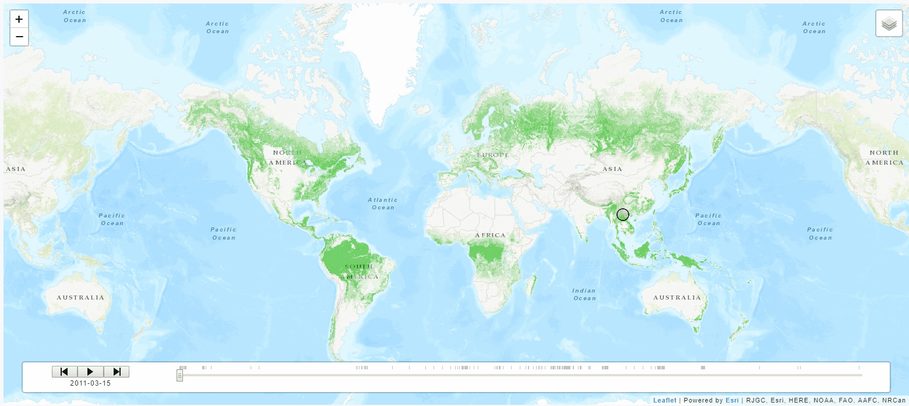

## Synopsis
+ Visualize the Earth's deforestation from 2000-2012 using Leaflet overlays
+ Visualize animal density (by class or species) from 2010-2017 using Leaflet Timeline
+ Deploy [App](https://deforestation.herokuapp.com/) to Heroku

## Built With
+ Python
+ [Flask-MySQLdb](https://flask-mysqldb.readthedocs.io/en/latest/)
+ [MySQLdb](https://mysqlclient.readthedocs.io/)
+ JavaScript
+ [Leaflet](https://leafletjs.com/)
+ [ESRI Leaflet](https://esri.github.io/esri-leaflet/)
+ [Leaflet Timeline](https://github.com/skeate/Leaflet.timeline)
+ [Moment.js](https://momentjs.com/)
+ [Bootstrap/JQuery](https://getbootstrap.com/)
+ HTML/CSS
+ [Heroku](https://www.heroku.com/)
## Resources
+ Deforestation overlays: http://data.globalforestwatch.org/
+ Field Museum of Natural History: https://www.gbif.org/
## API Reference
+ Tree Loss [API](http://gis-treecover.wri.org/arcgis/rest/services/ForestCover_lossyear_density/ImageServer/) 2000 to 2012
+ Tree Gain [API](http://ec2-50-18-182-188.us-west-1.compute.amazonaws.com:6080/arcgis/rest/services/ForestGain_2000_2012/ImageServer/) 2000 to 2012
+ Total Tree Coverage [API](http://ec2-50-18-182-188.us-west-1.compute.amazonaws.com:6080/arcgis/rest/services/TreeCover2000/ImageServer/) as of 2000
## Contributors
+ [Motolani Alimi](https://github.com/motolanialimi)
+ [Juliana Kennedy](https://github.com/jkennedy74)
+ [Bryan Schwierzke](https://www.linkedin.com/in/bryan-schwierzke/)
## License
+ none
## Acknowledgments
+ Northwestern Data Science Boot Camp
+ [Markdown-Cheatsheet](https://github.com/adam-p/markdown-here/wiki/Markdown-Cheatsheet)